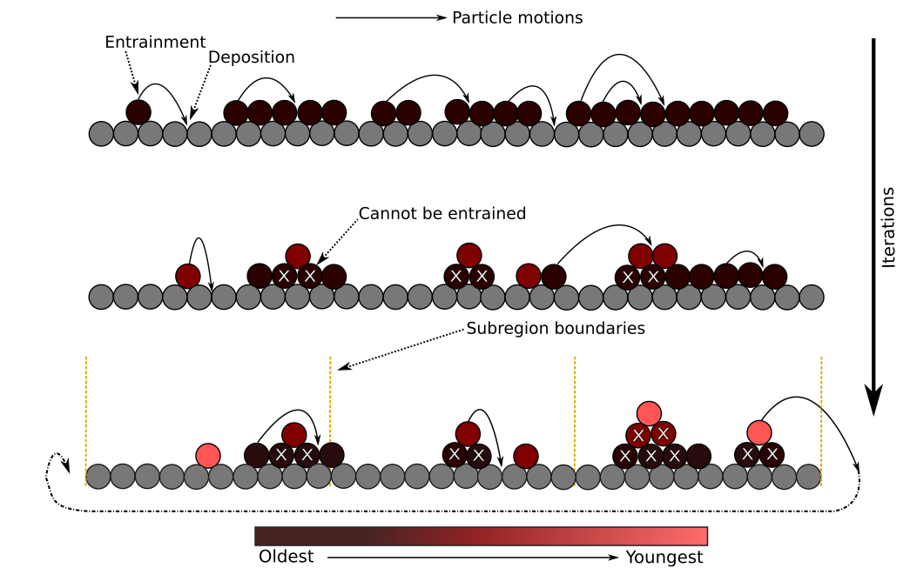
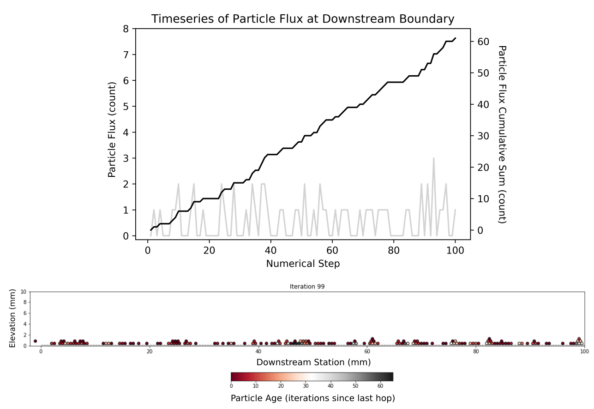

# Summary

Granular sediment of various sizes moves downstream along river beds when water flow is capable of entraining particles from 
the bed surface. This process is known as bed load sediment transport because the particles travel close to the boundary. 
It is common to treat the transport process as a predictive problem in which the mean transport rate past a stationary 
observation point is a function of local water flow conditions and the grain size distribution of the bed material 
[@Parker:2008; @Wainwright:2014; @Ancey:2020]. However, a predictive approach to the bed load problem neglects the stochastic 
nature of transport due to the movements of individual particles [@Einstein:1937; @FurbDoane:2021], and interactions between
moving particles and those on the bed surface [@Ancey:2006; @Ancey:2008;LeeJerol:2018]. Here, we present an open-source Python model,
`pySBeLT`, which simulates the kinematics of rarefied particle transport (low rates) as a stochastic process along a riverbed profile.
The primary aim of `pySBeLT` is to offer an efficient and reasonable numerical means to help in examining connections between individual
particle motions and local transport rates, or the flux. We suggest that `pySBeLT` is a suitable teaching tool to help introduce 
bed load transport to advanced undergraduate and graduate students alike.

# Statement of need

Research at the intersection of geomorphology, geophysics and hydraulics is increasingly focused on building 
a theoretical foundation for the treatment of bedload transport as a stochastic phenomenon [@Ancey:2020; 
@FurbDoane:2021]. Associated theories are commonly tested against laboratory data from "rarefied" transport 
conditions [@Furb:2016], where transport rates are low to moderate, interactions between two or more 
moving particles are rare, and a relatively small fraction of particles on the bed surface participate in transport 
[@Ancey:2010; @Roseberry:2012; @Fathel:2015; @Wu:2019]. For example, laboratory experiments 
using a downstream light table counting device and conducted at roughly twice the threshold for particle motion involve 
the transport of less than approximately 12% of particles on the upstream bed surface [@Chartrand:2017]. This result 
highlights that the flux measured across a boundary or within an area of bed surface is directly linked to the motions 
of individual particles arriving from upstream locations [@Furbish:2012]. 

Because particle motions are controlled by fluid turbulence, the irregular bed surface, and collective effects 
[@Ancey:2006; @Ancey:2008; @LeeJerol:2018], the connection between particle movements and the bedload 
transport rate has been difficult to formulate mathematically. `pySBeLT` provides an extensible framework within 
Python to numerically examine correlations between upstream particle entrainment rates and travel distances, with downstream 
flux. `pySBeLT` was motivated by a birth-death, immigration-emigration Markov model for bedload transport [@Ancey:2008; @Ancey:2010]. 
Here, the movements of individual particles are represented by stochastic entrainment, motion, and deposition processes, and sediment 
flux is represented as a counting phenomenon where the number of particles in motion above the bed surface is a random 
variable [@Ancey:2008]. The model supports ensemble simulations so that repeat numerical experiments can be conducted efficiently,
or the problem can be probed across a range of input parameter values (discussed below).

`pySBeLT` is run forward in time according to default or user specified parameter values. After initialization, `pySBeLT` first constructs
a bed of fixed particles of **'set_diam'** in both the downstream and cross-stream dimensions (one particle wide in the present build), 
and over a downstream domain length **'bed_length'**. Bed surface particles of **'particle_diam'** are then randomly placed at vertices 
between fixed bed particles until the**'particle_pack_frac'** is met. Vertices are defined by a contact point between two adjacent particles. 
The bed of surface particles is then separated into **'num_subregions'** set by the user. Subregion boundaries occur at domain 
locations set by a distance = **'bed_length'** / **'num_subregions'**. Following construction of the bed surface the forward simulations are
ready to commence. 

Simulation iterations involve three steps (Fig. 1): (1) the number of particle entrainment events per **'num_subregions'** are drawn from a Poisson pmf, 
and this is done randomly for each numerical step up to **'iterations'**; (2) surface particles from each subregion are randomly selected 
for entrainment, and if there are insufficient surface particles available for entrainment, then all available particles are moved; (3) each 
entrained particle moves a distance according to a randomly sampled value from either the normal or lognormal distribution (see THEORY.md for more 
details), and is placed at the nearest vertex between two particles that is available for placement. Placed particles are permitted to stack up to the
**'level_limit'** in height. Particles are not permitted to travel to the same available vertex. To stop this from occuring the entrained particles are
moved in random order and once a particle is placed on a vertex, that vertex is no longer considered available for any subsequent particle entrainments
for that iteration. Travel distances of particles that exceed **'bed_length'** are returned and queued at the upstream boundary, and are introduced back
into the domain at the next numerical step according to travel distance sampling described above. This specifially means that the particle travel
distance which resulted in crossing of the downstream domain does not influence the travel distance of the particle when queued at the upstream
domain--a new travel distance for such particles will be sampled during the next numerical step. This overall process repeats for the specified
**'iterations'**.

`pySBeLT` tracks a number of different parameters through a simulation: the vertical and horizontal positions of every particle center, 
the randomly sampled number of entrainment events, the number of particles actually entrained, the actual particle travel distance, 
the particle ‘age’, or the number of numerical steps since last entrainment for every particle, and the number of particles which cross all boundaries,
i.e. sub-region and downstream at x_max. All values, or the values needed to derive this information, are stored in HDF5 data files using the `h5py` 
package [@Collette:2014]. 

`pySBeLT` produces a time varying signal of particle flux counted at the downstream domain (as well as internal subregion domains), with a particle 
bed that changes through particle stacking and pile removal, and downstream motions of travel distance (Fig. 2). An implication of particle 
stacking within the context of the `pySBeLT` stochastic framework is a time varying signal of the average “particle age”, as well as the 
average “particle age range”, defined as the difference of the maximum and minimum particle ages. The model can be readily modified to simulate 
kinematics using different probability distributions (see THEORY.md for more details), or examining particle age dynamics for deeper beds of particles
available for transport. The relatively simple parameterization of `pySBeLT` execution also makes it suitable for use as a teaching tool within advanced
undergraduate and graduate courses emphasizing bed load sediment transport.

# Figures

|
|:--:| 
| *Figure 1. Graphic illustrating the three steps of particle transport modelling by `py_SBeLT`. The **'level_limit'** in height is set to 3 in the graphic.* |

|
|:--:| 
| *Figure 2. Example `py_SBeLT` output of particle flux at downstream boundary and particle bed configuration at numerical step 100* |

# Acknowledgements

S. Zwiep was funded in part through an Undergraduate Student Research Award from the 
National Science and Engineering Research Council of Canada (NSERC). S.M. Chartrand was 
funded through a Postdoctoral Fellowship awarded by NSERC, and through internal research 
funding provided by Simon Fraser University. The model was inspired by discussions with 
D.J. Furbish, who also provided useful input and critical feedback at various stages 
of model development and testing. K. Pierce also provided helpful feedback during model 
development. G. Baker provided insightful mentorship for S. Zwiep during improvements to the model.

# References
